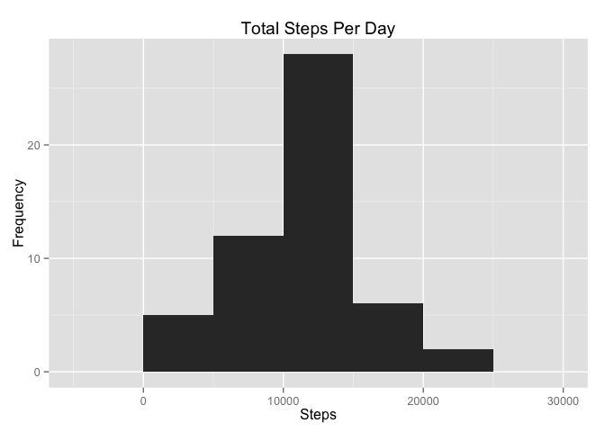
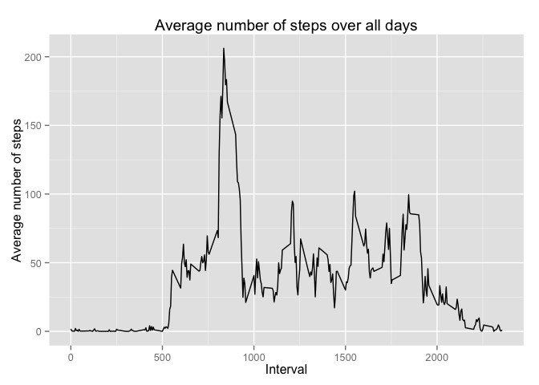
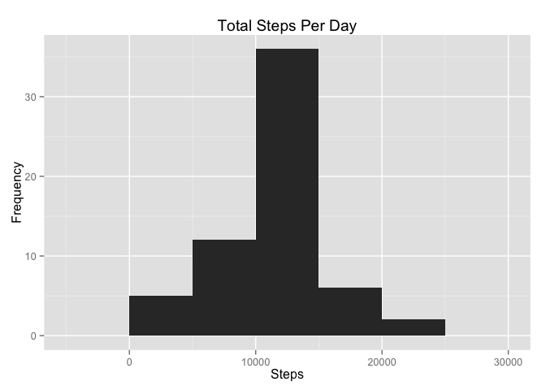
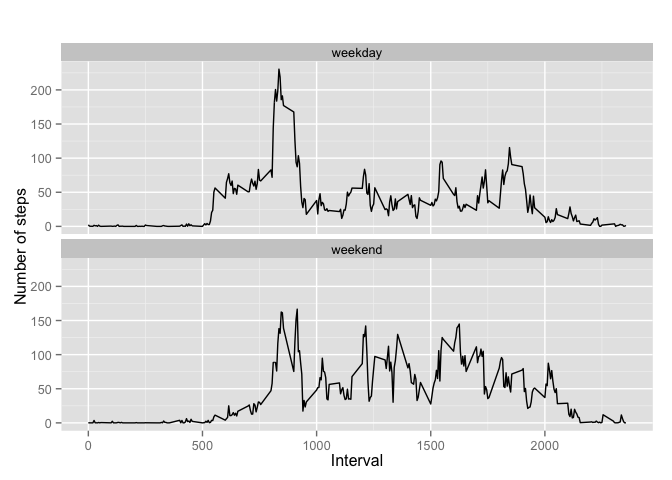

# Reproducible Research: Peer Assessment 1


## Loading and preprocessing the data

```r
library("knitr")
```

```
## Warning: package 'knitr' was built under R version 3.1.3
```

```r
library("rmarkdown")
## Constants ##
localFile <- "activity.zip"

## Download and unzip 
# Skip unzipping if data exist
if (!file.exists("activity.csv")) {
  unzip(localFile)
}

## load data
activitydata <- read.csv("activity.csv")
## select complete cases 
actcompltedata <-activitydata[complete.cases(activitydata),]
```


## What is mean total number of steps taken per day?

```r
library(ggplot2) 
tabledata <- aggregate(steps ~ date,actcompltedata, sum)

myplot <- qplot(tabledata$steps, geom="histogram", binwidth = 5000) 
myplot + labs(list(title = "Total Steps Per Day", x = "Steps", y = "Frequency"))
```

 

```r
mean(tabledata$steps)
```

```
## [1] 10766.19
```

```r
median(tabledata$steps)
```

```
## [1] 10765
```

The mean number of steps taken per day is 10766.
The median number of steps taken per day is 10765.

## What is the average daily activity pattern?


```r
# preprocessing data for plot
stepsinterval <- aggregate(steps ~ interval, actcompltedata, mean)

intervalplot <- qplot(stepsinterval$interval, stepsinterval$steps, geom="line")
intervalplot + labs(list(title = "Average number of steps over all days", x = "Interval", y = "Average number of steps"))
```

 

```r
#preparefuction 
# find row with max of steps
maxsteps <- which.max(stepsinterval$steps)
# find interval with this max
stepsinterval[maxsteps, ]
```

```
##     interval    steps
## 104      835 206.1698
```

```r
pit <- stepsinterval[maxsteps, ]
```
The interval 835, contains the maximum number of steps (206.2).

## Imputing missing values


```r
sum(is.na(activitydata))
```

```
## [1] 2304
```

There are 2304 missing values in the dataset. 

For imputing missing values I use mean for that 5-minute interval caluclated earlier and presented on above graph.

```r
dataimputed <- activitydata
for (i in 1:nrow(dataimputed)) {
  if (is.na(dataimputed$steps[i])) {
    intervalvalue <- dataimputed$interval[i]
    stepsvalue <- stepsinterval[
      stepsinterval$interval == intervalvalue,]
    dataimputed$steps[i] <- stepsvalue$steps
  }
}

tabledataimputed <- aggregate(steps ~ date,dataimputed, sum)

myplot <- qplot(tabledataimputed$steps, geom="histogram", binwidth = 5000) 
myplot + labs(list(title = "Total Steps Per Day", x = "Steps", y = "Frequency"))
```

 

```r
mean(tabledataimputed$steps)
```

```
## [1] 10766.19
```

```r
median(tabledataimputed$steps)
```

```
## [1] 10766.19
```

The mean number of steps taken per day is 10766.
The median number of steps taken per day is 10766.

The mean with imputed values remains the same as mean calculated with NA values removed. Median is now higher by one step. 

## Are there differences in activity patterns between weekdays and weekends?

```r
df <- dataimputed ## save typing long name 
# convert date to Date class
df$date <- as.Date(df$date, "%Y-%m-%d")
# add a new column for storing day of the week 
df$day <- weekdays(df$date)
# add a new column to determine weekend or not
df$day_type <- c("weekday")
# If day is Saturday or Sunday, make weekend
for (i in 1:nrow(df)){
  if (df$day[i] == "Saturday" || df$day[i] == "Sunday"){
    df$day_type[i] <- "weekend"
  }
}

df_imputed_steps_by_interval <- aggregate(steps ~ interval + day_type, df, mean)

## plot it 
qplot(interval, 
      steps, 
      data = df_imputed_steps_by_interval, 
      type = 'l', 
      geom=c("line"),
      xlab = "Interval", 
      ylab = "Number of steps", 
      main = "") +
  facet_wrap(~ day_type, ncol = 1)
```

 


```r
# remove the data frames to free memory
rm(localFile, activitydata, actcompltedata,tabledata,myplot, stepsinterval,maxsteps, pit, dataimputed, tabledataimputed, df,df_imputed_steps_by_interval)
```
